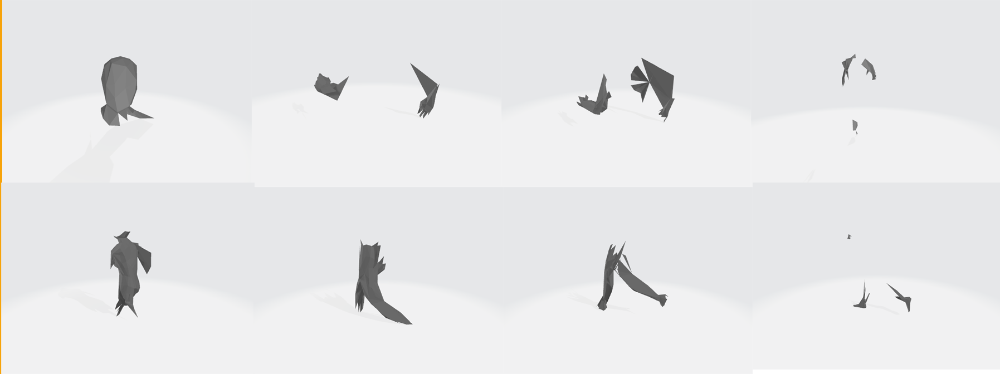

# Modifiying MeshCNN

## The assignment
We were required to apply some modifications on the original <a href="https://ranahanocka.github.io/MeshCNN/">MeshCNN</a>
 project.
The task was to achieve better accuracy results on 2 specific data sets:
<ul>
<li>Human (segmentation task)</li>
<li>Cubes (classification task)</li>
</ul>
For details about the project, citing and howtos, please visit the  <a href="https://github.com/ranahanocka/MeshCNN/">main repo</a>.

### NOTE
This isn't a good practice for improving a DL model. All we achieved is tighter fitting to specific datasets, which probably results in OVERFIT and worse results on general data.
It's not enough that we separate data sets to train and test sets, because we can't measure what matters – how the algorithm will perform on new data.
A better practice would be splitting the data into 3 sets: train, validation and test, or to use cross validation by splitting the data into folds.
The validation set assigned to setting and optimizing the Hyperparameters while the test set to estimate the final model success, and hence the model can't reach this data before it's done.

# What we tried?
<ol class="c16 lst-kix_wfe3e81sw3y3-0 start" start="1"><li class="c6">Activation function we tried using tanh, sigmoid and leaky relu instead of the relu layers.</li><li class="c6">Modifying learning rate</li><li class="c6">Tweaking the batch size</li><li class="c6">Changing </li><li class="c6">Changing the loss reduction type from mean to std and median.</li><li class="c6">Changing init type</li><li class="c6">Modifying resblock</li><li class="c6">Adding kernel features: Norm / Sum /Std /Multiplication and division of the edges (which resulted in NaN)</li><li class="c6">Adding dropout - during training we zero some of the activations (and don’t update those weights). It is a kind of regularization- good for generalization. </li><li class="c6">Adding layers to the classification network. We tried adding a fully connected layer between any 2 convolution layers.</li><li class="c6">Changing the parameter for edge collapse: Randomly collapsing edges</li></ol>

We also used many combinations of the above
Partial results and code for these modifications is attached.

## The final model
 The final model included just modest tweaks:
 <ul>
 <li>Adding droput. </li>
 <li>Replacing the activation function (leaky relu). </li>
 <li>Adding a  features to the kernal (sum+std). </li>
</ul>

# The results

<table class="c26"><tbody><tr class="c1"><td class="c35" colspan="2" rowspan="1">
segmentation
</td><td class="c13" colspan="2" rowspan="1">
classification
</td></tr><tr class="c6"><td class="c18" colspan="1" rowspan="1">
1st&nbsp; run
</td><td class="c12" colspan="1" rowspan="1">
2nd&nbsp;run
</td><td class="c15" colspan="1" rowspan="1">
1st&nbsp; run
</td><td class="c15" colspan="1" rowspan="1">
2nd&nbsp;run
</td></tr><tr class="c1"><td class="c18" colspan="1" rowspan="1">
&nbsp;95.094%
</td><td class="c12" colspan="1" rowspan="1">
&nbsp;95.669%
</td><td class="c15" colspan="1" rowspan="1">
&nbsp;97.56%
</td><td class="c15" colspan="1" rowspan="1">
&nbsp;96.681%
</td></tr><tr class="c1"><td class="c18" colspan="1" rowspan="1">
&nbsp;95.085%
</td><td class="c12" colspan="1" rowspan="1">
&nbsp;95.203%
</td><td class="c15" colspan="1" rowspan="1">
&nbsp;97.37%
</td><td class="c15" colspan="1" rowspan="1">
&nbsp;96.343%
</td></tr><tr class="c1"><td class="c18" colspan="1" rowspan="1">
&nbsp;95.106%
</td><td class="c12" colspan="1" rowspan="1">
&nbsp;94.851%
</td><td class="c15" colspan="1" rowspan="1">
&nbsp;96.47%
</td><td class="c15" colspan="1" rowspan="1">
&nbsp;94.674%
</td></tr><tr class="c1"><td class="c35" colspan="2" rowspan="1">
Average&nbsp;95.168%
</td><td class="c13" colspan="2" rowspan="1">
Average 96.516%
</td></tr></tbody></table>

# visualization

